# SignalShop

Assistant commercial intelligent connecté à Signal. Gérez catalogue, commandes, clients et conversations sans effort.

## Fonctionnalités
- 🤖 IA conversationnelle (règles métier strictes, pas d'invention)
- 📦 Catalogue produits avec variantes, options, stocks
- 🧾 Commandes avec statuts, créneaux, zones de livraison
- 💬 Conversations Signal avec prise en main humaine
- 👥 Gestion des utilisateurs et permissions
- 📊 Statistiques et export CSV
- 🔔 Notifications en temps réel (son)
- ⭐ Évaluations clients
- 📱 PWA installable sur mobile

## Captures d'écran

### Accueil
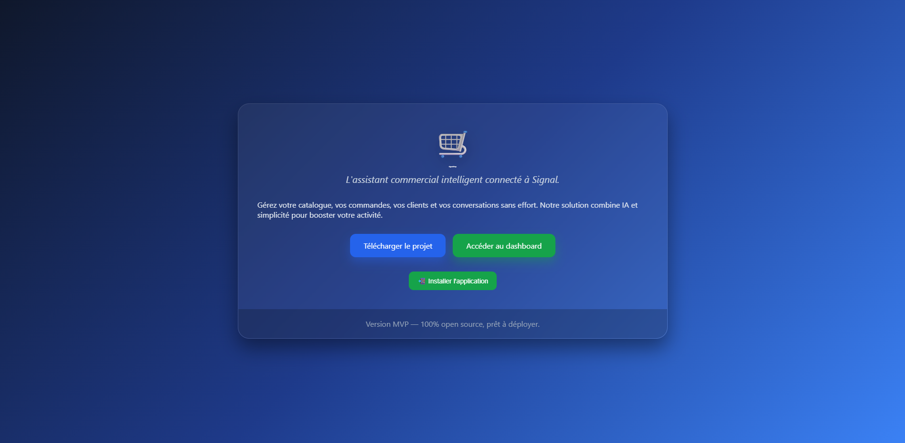

### Connexion
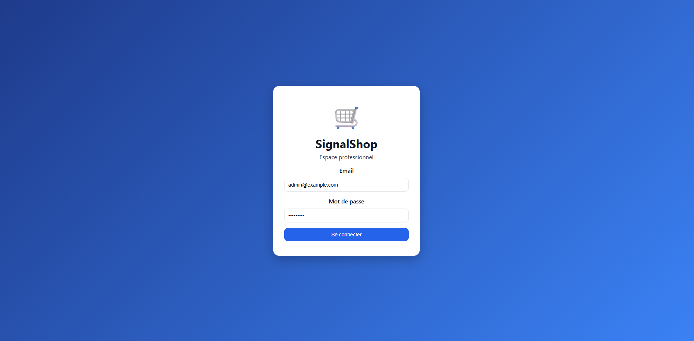

### Tableau de bord
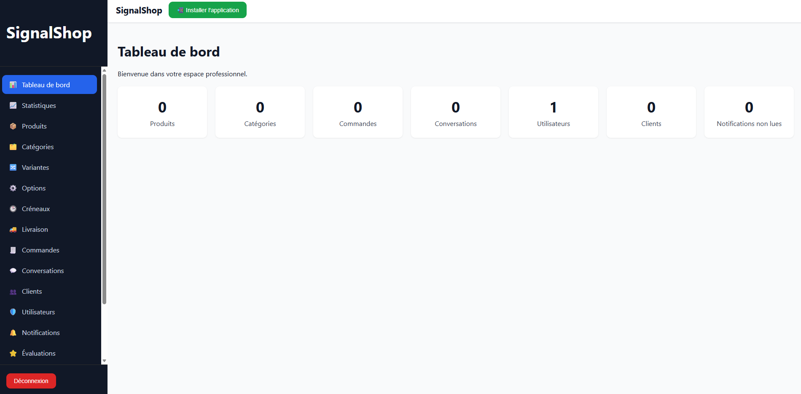

### Produits
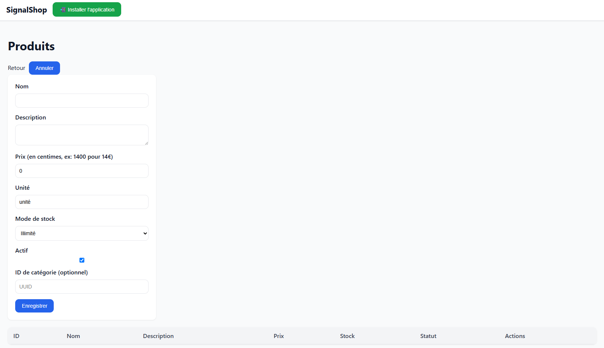

### Catégories
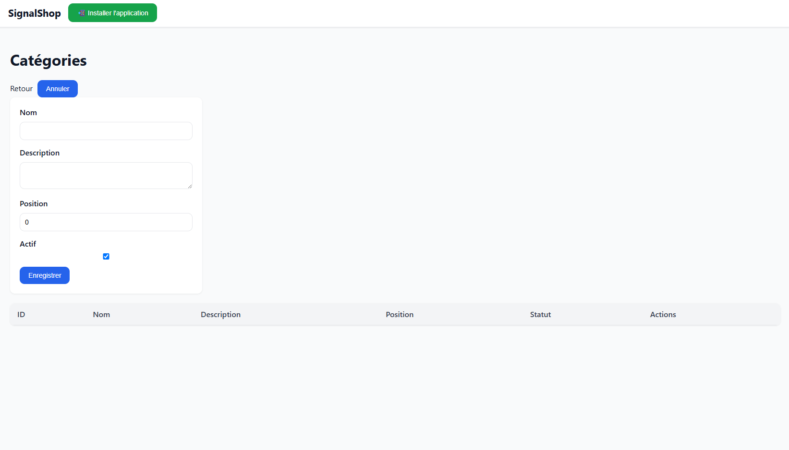

### Variantes
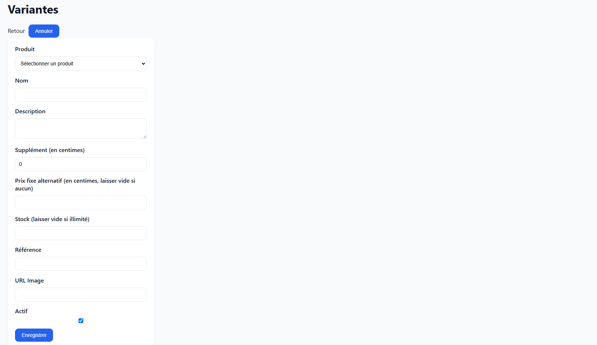

### Options
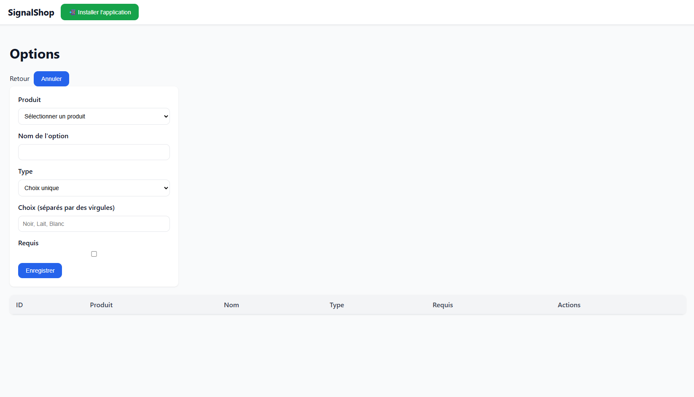

### Créneaux
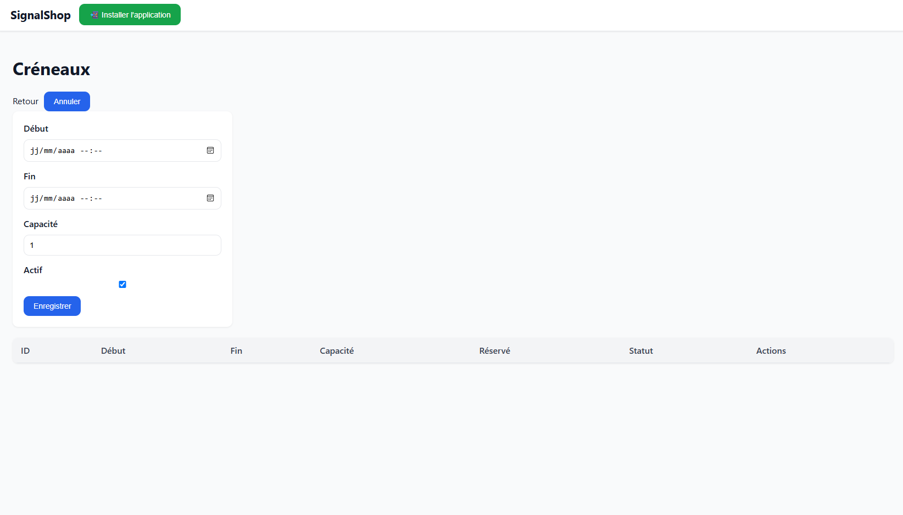

### Livraison
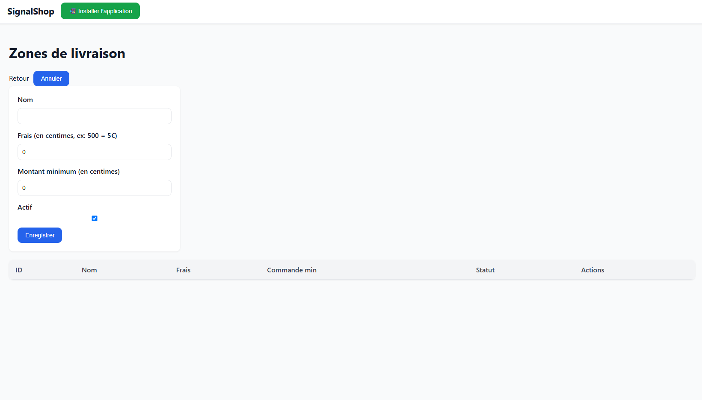

### Commandes
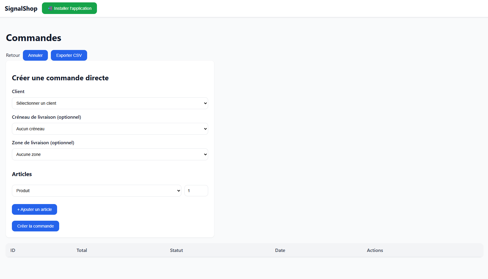

### Conversations
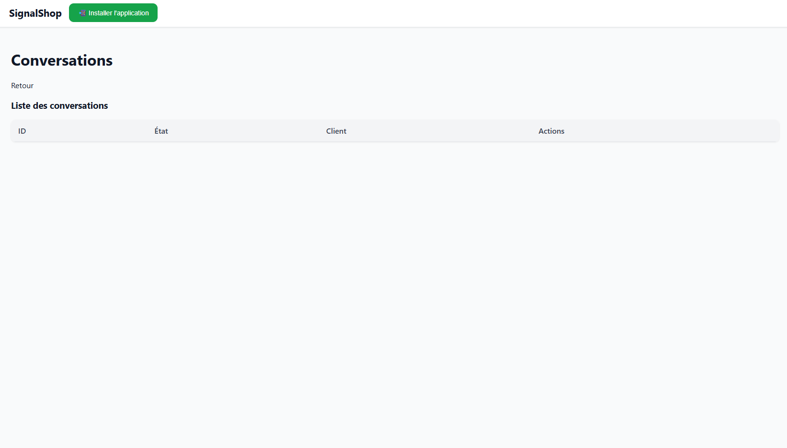

### Clients
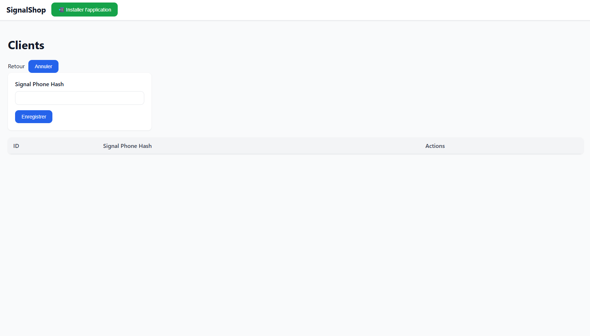

### Utilisateurs
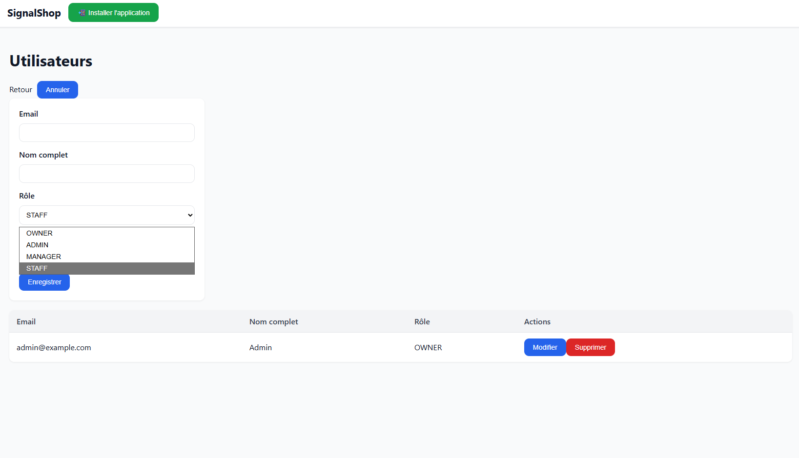

### Notifications
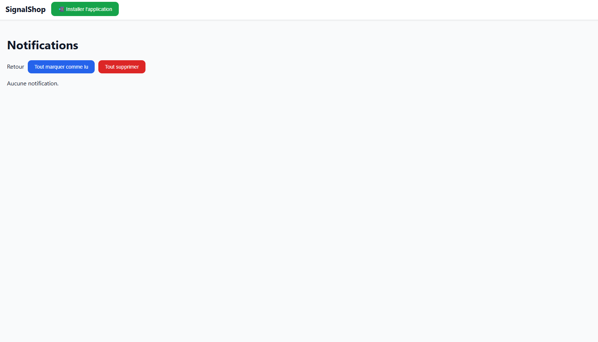

### Évaluations
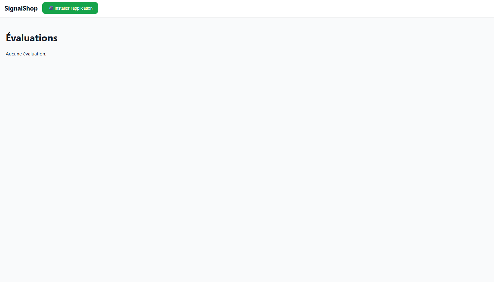

### Permissions
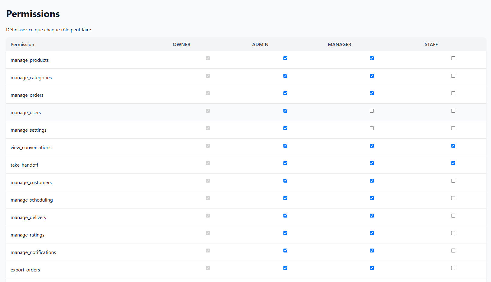

### Journal d'audit

### Paramètres
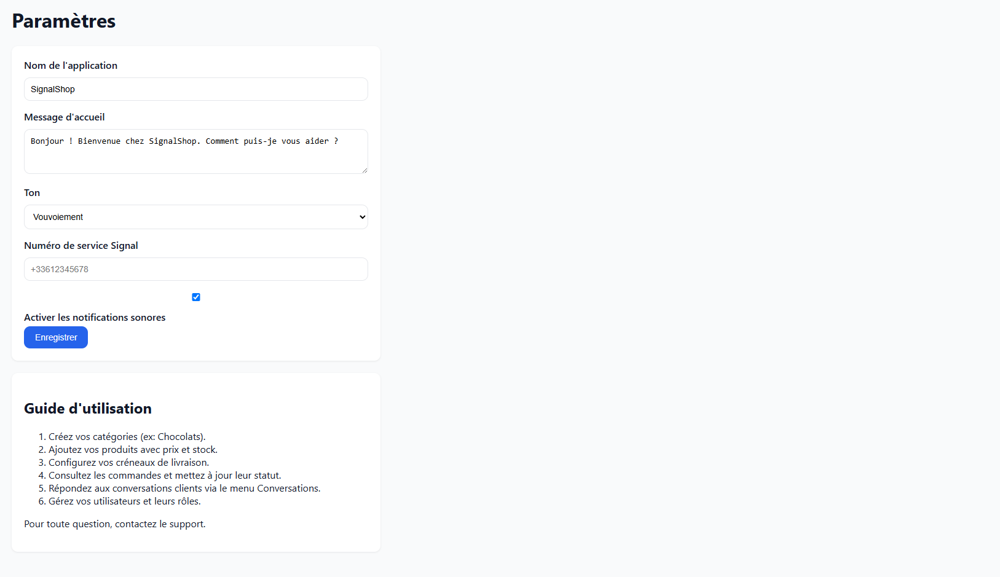

### Installation
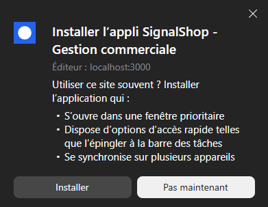

## Installation rapide (Windows)
1. Téléchargez `SignalShop_Installer.exe` (ou utilisez `install.bat`).
2. Lancez l'installateur et suivez les instructions.
3. Accédez au dashboard sur `http://localhost:3000`.

## Communauté
Rejoignez le Discord : [https://discord.gg/mvpXXSPeRA](https://discord.gg/mvpXXSPeRA)

## Documentation
- [Guide client](GUIDE_CLIENT.md)
- [Documentation technique](docs/)

## Licence
MIT